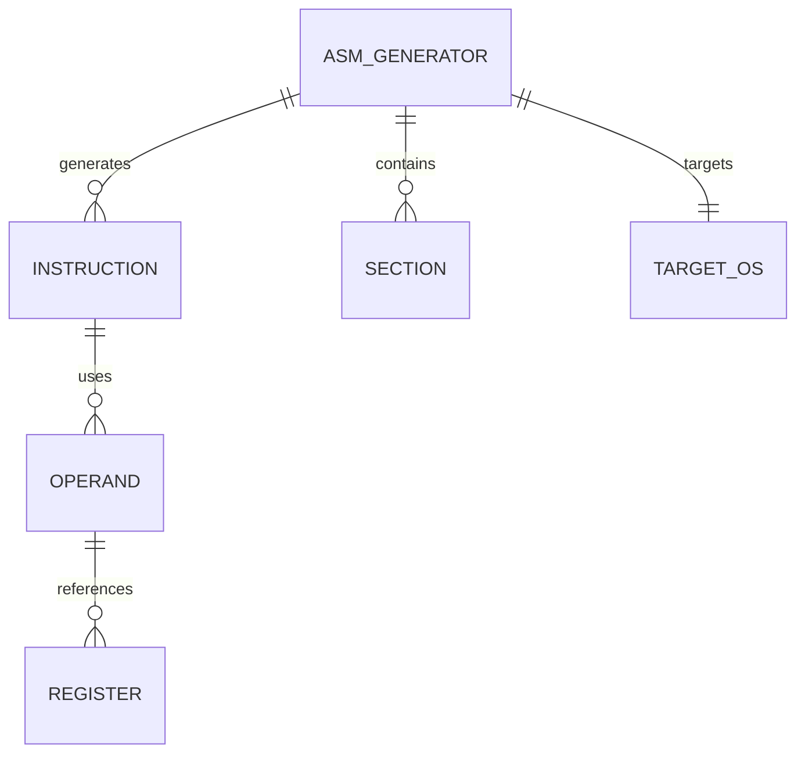

# Data Model: ASM Generation Components

## Entities

### ASM Generator
**Description**: This module, referred to as the code generator, converts compiler intermediate representations into NASM x86-64 assembly instructions. It serves as a crucial stage in the compilation pipeline, translating platform-independent code into low-level instructions optimized for execution on x86-64 architectures.

**Fields of the Assembly Program Structure**:

- `sections`: A list of assembly sections, such as `.text` (code) and `.data` (initialized data). Each section represents a distinct region of the program's memory layout and serves a specific purpose in code execution or data storage.

- `current_section`: A pointer or reference to the section that is currently active during the assembly process. This field determines where newly generated instructions or data are placed.

- `labels`: A mapping of defined labels to their corresponding memory addresses or instruction offsets. Labels are used to identify positions in the code for jumps, calls, and data access, ensuring proper control flow and address resolution.

- `instructions`: An ordered sequence of generated instructions, represented either as assembly mnemonics or intermediate code. This field captures the program logic in the order it will be executed or assembled.

**Methods**

- `new()`: Initializes a new ASM (assembly) generator object with default configuration, preparing it for creating assembly programs.

- `add_section(name: &str)`: Adds a uniquely named section to the assembly program. Sections organize instructions into distinct blocks for logical or functional separation.

- `switch_section(name: &str)`: Sets the specified section as the active section. All subsequent instructions or labels will be added to this section.

- `add_instruction(inst: Instruction)`: Inserts the provided instruction into the currently active section. The method ensures the instruction is added at the correct position within the section.

- `add_label(name: &str)`: Inserts a label at the current instruction offset in the active section, allowing other instructions to reference this location.

- `generate()`: Returns the complete assembly code as a formatted string, suitable for output or compilation.

**Relationships**:
- Instruction Entities: Employed to facilitate the process of code generation, ensuring that program logic is translated into executable instructions accurately.
- Register Entities: Accessed to manage operands, providing the necessary storage and retrieval mechanisms for instruction execution.
- Operand Entities: Utilized to define instruction operands, specifying the data elements involved in each instruction’s operation.

### Instruction
**Description**: Represents a single assembly instruction, encapsulating its mnemonic, operands, and optional encoding information. This structure allows for systematic construction, modification, and textual representation of assembly instructions.

**Fields**:
- `mnemonic`: A string representing the instruction mnemonic (e.g., "mov", "add", "jmp").  
- `operands`: A collection (vector) of operand objects, each representing a value or register used by the instruction.  
- `encoding`: Optional binary encoding data representing the machine-level instruction.

**Methods**:
- `new(mnemonic: &str)`: Constructs a new instruction object initialized with the specified mnemonic.  
- `add_operand(operand: Operand)`: Appends an operand to the instruction's operand list.  
- `format()`: Generates a string representing the instruction in standard assembly syntax, including mnemonic and operands.

**Relationships**:
- **Contains Operand Entities:** This entity encompasses operand entities, which serve as the fundamental components for its operations and interactions within the system.
- **Referenced by ASM Generator:** This entity is referenced by the ASM Generator module, indicating that it is utilized as part of the assembly code generation process.

### Register
**Description**: Represents a CPU register, detailing its properties, encoding, and functionality within a processor. Registers serve as fundamental storage locations for CPU operations and play a crucial role in instruction execution.

**Fields**:
- `name`: The identifier for the register (e.g., "rax", "rbx", "r8").  
- `size`: The width of the register in bits (8, 16, 32, or 64), indicating the amount of data it can store.  
- `encoding`: The numerical index used for instruction encoding in machine code.  
- `aliases`: Alternative names for the register, typically used to denote registers of different sizes or specialized purposes.

**Methods**:
- `new(name: &str, size: u8, encoding: u8)`: Initializes a new register instance with the specified name, size, and encoding.  
- `get_alias(size: u8)`: Returns the register’s alias corresponding to the specified size, if one exists.  
- `format()`: Produces a string representation of the register suitable for assembly code output, following standard syntax conventions.

**Relationships**:
- Utilized by Operand objects to represent register-based operands within instructions.  
- Referenced by Instruction objects to specify registers involved in CPU operations, facilitating instruction decoding and execution.

### Operand

**Description**: An operand represents a value or reference that an assembly instruction operates on. It serves as the input for computational operations and can take multiple forms depending on the instruction’s requirements.

**Variants**:
- `Register(Register)`: Represents an operand stored in a CPU register.
- `Immediate(i64)`: Represents a constant value directly encoded within the instruction.
- `Memory(base: Option<Register>, index: Option<Register>, scale: u8, displacement: i32)`: Represents a memory reference operand. The `base` and `index` fields specify registers used to compute the memory address, `scale` multiplies the index value, and `displacement` provides an optional offset.

**Methods**:
- `format()`: Returns a string representation of the operand, suitable for assembly code output.

**Relationships**:
- Holds references to `Register` entities for register operands.
- Utilized by `Instruction` entities to define the operands associated with each operation.

### TargetOS Module

**Description**: Provides a comprehensive overview of the operating systems supported by the application, enabling OS-specific configurations and operations.

**Variants**:
- `Linux`: Operating systems based on the Linux kernel, including popular distributions such as Ubuntu, Fedora, and Debian.
- `Windows`: Microsoft Windows operating systems, covering versions from Windows 7 to the latest Windows 11.
- `macOS`: Apple’s macOS operating systems, compatible with Intel and Apple Silicon architectures.

**Methods**:
- `get_calling_convention()`: Retrieves the calling convention used by the operating system, specifying how functions receive arguments and return values. This is essential for generating accurate low-level code.
- `get_system_calls()`: Provides detailed information about the system calls available on the operating system, including their identifiers, parameters, and typical usage patterns.

**Relationships**:
- Utilized by the ASM Generator module to produce OS-specific code that adheres to the calling conventions and system call interfaces of each target operating system.

## Validation Rules

1. **Instruction Validation**:
   - Each instruction must include a valid mnemonic.
   - Operands must be compatible with the instruction in terms of type and size.
   - The maximum number of operands must not exceed the limit defined for the specific instruction.

2. **Register Validation**:
   - Register names must be valid for the target architecture.
   - Register sizes must correspond to the requirements of the operation being performed.

3. **Operand Validation**:
   - Operands must be of supported types, such as registers, immediate values, or memory references.
   - Memory operands must utilize valid addressing modes compatible with the architecture.

4. **Section Validation**:
   - Section names must be valid identifiers, containing only letters, digits, or underscores, and must begin with a letter.
   - Only one section may be active at any given time; overlapping sections are not permitted.

## State Transitions

This section describes the various states involved in the operation of the ASM generator and the instruction construction process.

### 1. ASM Generator State
The ASM generator transitions through several states as sections and instructions are managed:

- **Initial State**: The generator contains no sections, and no current section is selected.  
- **Section Added**: A new section is included in the collection of sections maintained by the generator.  
- **Section Switched**: The generator updates the current section to a different section from the collection.  
- **Instruction Added**: A new instruction is appended to the currently active section.  
- **Label Added**: A label is inserted at the current position within the active section.

### 2. Instruction State
Instructions themselves progress through a sequence of states during their construction and formatting:

- **Initial State**: Only the instruction mnemonic is defined; no operands are assigned.  
- **Operand Added**: An operand is appended to the instruction's operand list.  
- **Formatted**: The instruction is converted into properly formatted assembly language text, ready for output or further processing.

## Relationships

