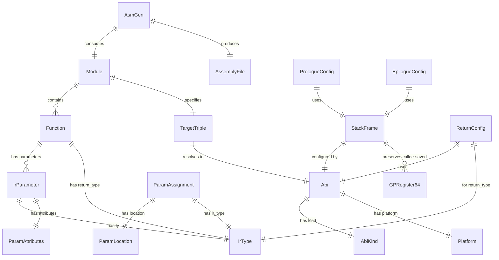
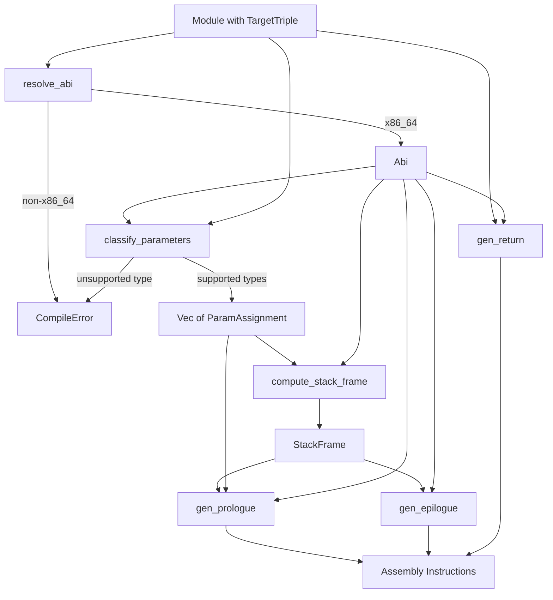

# Data Model: ABI-Compliant Parameter Passing and Return Value Handling

**Feature**: 025-abi-param-passing  
**Date**: 2026-02-12  
**Status**: Complete

---

## Entity Relationship Diagram



---

## Core Entities

### 1. ParamLocation (NEW — `src/codegen/param.rs`)

Represents the physical location of a parameter after ABI classification.

| Field | Type | Description | Constraints |
|-------|------|-------------|-------------|
| — | enum variant | One of three variants | Mutually exclusive |

**Variants**:

| Variant | Inner Type | Description |
|---------|-----------|-------------|
| `GpRegister` | `GPRegister64` | Parameter in a general-purpose register (RDI, RSI, RDX, RCX, R8, R9, etc.) |
| `XmmRegister` | `XMMRegister` | Parameter in an XMM register (XMM0–XMM7) |
| `Stack` | `{ offset: i32 }` | Parameter on the stack at an RBP-relative offset |

**Validation Rules**:

- `Stack.offset` must be ≥ 16 (System V) or ≥ 48 (Windows) — no parameter can be below the return address + saved RBP + shadow space
- `Stack.offset` must be a multiple of 8 (all stack slots are 8-byte aligned)
- Register indices must be within ABI bounds (e.g., no XMM8 for Windows which only has XMM0–XMM3)

**State Transitions**: None — immutable once created.

---

### 2. ParamAssignment (NEW — `src/codegen/param.rs`)

Pairs a parameter with its ABI-classified location.

| Field | Type | Description | Constraints |
|-------|------|-------------|-------------|
| `index` | `usize` | Zero-based position in the function signature | 0 ≤ index < params.len() |
| `name` | `Arc<str>` | Parameter name from IR | Non-empty |
| `ir_type` | `IrType` | The IR type of the parameter | Must be an ABI-supported type |
| `location` | `ParamLocation` | Physical location after classification | Valid for the target ABI |

**Validation Rules**:

- `ir_type` must NOT be `String`, `Array`, `Struct`, `Void`, or `Custom` — these produce `CompileError`
- `index` must match the parameter's actual position in the function signature
- Two `ParamAssignment`s in the same function MUST NOT share the same `ParamLocation`

**State Transitions**: None — immutable once created by `classify_parameters()`.

---

### 3. ParamClass (NEW — `src/codegen/param.rs`)

Internal classification of an `IrType` for ABI register assignment.

| Variant | Description | Corresponding IrTypes |
|---------|-------------|----------------------|
| `Integer` | General-purpose register class | I8, I16, I32, I64, U8, U16, U32, U64, Bool, Char, Pointer(*) |
| `Float` | XMM register class | F32, F64 |

**Validation Rules**:

- Classification is exhaustive for all supported types
- `String`, `Array`, `Struct`, `Void`, `Custom` → `CompileError` (not classifiable)
- `by_val` attribute is ignored — classification is solely by `IrType`

---

### 4. StackFrame (NEW — `src/codegen/stack.rs`)

Represents the computed stack frame layout for a function.

| Field | Type | Description | Constraints |
|-------|------|-------------|-------------|
| `locals_size` | `u32` | Total bytes for local variables | ≥ 0 |
| `shadow_space` | `u32` | Shadow space (0 for System V, 32 for Windows) | 0 or 32 |
| `preserved_gp_regs` | `Vec<GPRegister64>` | Callee-saved GP registers to preserve | Subset of ABI callee-saved set |
| `preserved_xmm_regs` | `Vec<XMMRegister>` | Callee-saved XMM registers to preserve (Windows only) | Subset of XMM6–XMM15 |
| `total_stack_alloc` | `u32` | Total `sub RSP, N` value (includes padding) | Multiple of 8; ensures 16-byte alignment after all pushes |
| `is_leaf` | `bool` | Whether the function contains any `call` instructions | Determines red zone eligibility |
| `uses_red_zone` | `bool` | Whether the function uses the red zone instead of RSP adjustment | Only true if System V + leaf + locals ≤ 128 |

**Validation Rules**:

- `total_stack_alloc` must ensure RSP is 16-byte aligned after `push RBP` + all callee-saved pushes + `sub RSP, N`
- `shadow_space` must be 32 for Windows, 0 for System V
- `uses_red_zone` can only be `true` if `is_leaf && shadow_space == 0 && locals_size <= 128`
- `preserved_gp_regs` must not include RBP (it's always pushed separately as the frame pointer)

**Alignment Formula**:
```
num_pushes = 1 (RBP) + preserved_gp_regs.len()
// After all pushes, RSP alignment state:
//   At function entry: RSP ≡ 8 (mod 16) due to return address
//   Each push subtracts 8 from RSP
//   After num_pushes pushes: RSP ≡ (8 + 8*num_pushes) mod 16
//   If num_pushes is odd: RSP is 16-byte aligned
//   If num_pushes is even: RSP is 8-byte misaligned

needs_padding = (num_pushes % 2) == 0
raw_alloc = locals_size + shadow_space
total_stack_alloc = if needs_padding { align_up(raw_alloc + 8, 16) } else { align_up(raw_alloc, 16) }
```

**State Transitions**: None — immutable once computed by `compute_stack_frame()`.

---

### 5. PrologueConfig (NEW — `src/codegen/prologue.rs`)

Input configuration for generating a function prologue.

| Field | Type | Description |
|-------|------|-------------|
| `func_name` | `Arc<str>` | Function name for label generation |
| `abi` | `Abi` | Target ABI |
| `stack_frame` | `StackFrame` | Computed stack frame layout |
| `param_assignments` | `Vec<ParamAssignment>` | Parameter locations for any needed register moves |

**Prologue Instruction Sequence**:

```
1. push rbp
2. mov rbp, rsp
3. push {callee-saved GP regs in order}
4. [if !uses_red_zone] sub rsp, total_stack_alloc
5. [if Windows + XMM callee-saved] movaps [rsp+offset], xmm6..xmm15
```

---

### 6. EpilogueConfig (NEW — `src/codegen/epilogue.rs`)

Input configuration for generating a function epilogue.

| Field | Type | Description |
|-------|------|-------------|
| `abi` | `Abi` | Target ABI |
| `stack_frame` | `StackFrame` | Computed stack frame layout (mirrors prologue) |

**Epilogue Instruction Sequence**:

```
1. [if Windows + XMM callee-saved] movaps xmm6..xmm15, [rsp+offset]
2. [if !uses_red_zone] mov rsp, rbp  (or add rsp, total_stack_alloc + callee_pushes * 8)
3. pop {callee-saved GP regs in REVERSE order}
4. pop rbp
5. ret
```

Actually the simpler and more robust epilogue with frame pointer is:
```
1. [if Windows + XMM callee-saved] restore XMM regs
2. lea rsp, [rbp - (num_callee_saved_pushes * 8)]
   OR mov rsp, rbp then pop callee-saved (but offset varies)
   Actually the simplest:
3. For each callee-saved GP (reverse order): pop
4. mov rsp, rbp  (reset RSP to where it was after push rbp)
   Wait — this doesn't work if callee-saved regs were pushed after mov rbp,rsp.
```

**Corrected Epilogue** (matching standard frame pointer convention):
```
Prologue order:
  push rbp
  mov rbp, rsp
  push rbx        ; callee-saved
  push r12        ; callee-saved
  sub rsp, N      ; locals + shadow + padding

Epilogue order:
  add rsp, N      ; OR: lea rsp, [rbp - 16]  (since 2 callee-saved regs pushed)
  pop r12         ; reverse order
  pop rbx         ; reverse order
  pop rbp
  ret
```

Actually the simplest correct approach with frame pointer:
```
  mov rsp, rbp    ; restore RSP to right after "push rbp"
  pop rbp         ; restore RBP
  ret

  BUT: this skips restoring callee-saved registers!
```

**Final Corrected Epilogue** (standard approach):
```
Prologue:
  push rbp
  mov rbp, rsp
  push rbx          ; [rbp-8]
  push r12          ; [rbp-16]
  sub rsp, N

Epilogue:
  add rsp, N        ; undo sub
  pop r12           ; reverse of prologue
  pop rbx
  pop rbp           ; same as: mov rsp, rbp; pop rbp but we already restored RSP
  ret

Alternative (using frame pointer shortcut):
  lea rsp, [rbp - 16]    ; 16 = 2 callee-saved * 8
  pop r12
  pop rbx
  pop rbp
  ret
```

---

### 7. ReturnConfig (NEW — `src/codegen/ret.rs`)

Configuration for generating return value placement.

| Field | Type | Description |
|-------|------|-------------|
| `return_type` | `IrType` | Function return type from IR |
| `abi` | `Abi` | Target ABI (affects FP 128-bit return) |

**Return Register Mapping**:

| IrType | Register(s) | Notes |
|--------|------------|-------|
| I8, U8, Bool | AL (via RAX) | Zero-extended in RAX |
| I16, U16, Char | AX (via RAX) | Zero-extended in RAX |
| I32, U32 | EAX | Writing EAX zeros upper 32 bits of RAX |
| I64, U64, Pointer | RAX | Full 64-bit register |
| (hypothetical I128) | RAX:RDX | RAX = low, RDX = high |
| F32 | XMM0 | Via `movss` |
| F64 | XMM0 | Via `movsd` |
| (hypothetical F128) | XMM0:XMM1 (System V), XMM0 (Windows) | ABI-dependent |
| Void | — | No register assignment |

---

## Existing Entities (unchanged)

### IrType (EXISTING — `src/ir/types.rs`)

No modifications needed. Full enum with all variants. Key classification for this feature:

| Category | IrType Variants | ABI Class |
|----------|----------------|-----------|
| Integer class | I8, I16, I32, I64, U8, U16, U32, U64, Bool, Char, Pointer(*) | GP registers |
| Float class | F32, F64 | XMM registers |
| Unsupported | String, Array, Struct, Custom | CompileError |
| No-op | Void | (return only — no register) |

### IrParameter (EXISTING — `src/ir/function.rs`)

No modifications needed. Fields:
- `name: Arc<str>` — parameter name
- `ty: IrType` — parameter type (used for classification)
- `attributes: ParamAttributes` — includes `by_val` (ignored per spec)

### Abi / AbiKind (EXISTING — `src/asm/abi.rs`)

No modifications needed. Already provides all necessary ABI metadata:
- `int_param_registers()`, `float_param_registers()` — parameter register lists
- `int_return_registers()`, `float_return_registers()` — return register lists
- `callee_saved_gp_registers()`, `callee_saved_xmm_registers()` — preservation sets
- `shadow_space()`, `red_zone()`, `alignment()` — stack properties

### TargetTriple (EXISTING — `src/ir/module.rs`)

No modifications needed. 9 variants. The `target_triple_to_abi()` function in `AsmGen` already handles x86_64 variants; non-x86_64 variants currently use `todo!()` which must be changed to return `CompileError`.

### CompileError (EXISTING — `src/error/compile_error.rs`)

Minor addition may be needed: new `ErrorCode` variants for:
- Unsupported parameter type (String/Array/Struct)
- Unsupported target triple (non-x86_64)

The `AsmGeneratorError` variant already exists and is suitable for these errors.

---

## Data Flow



---

## Error Conditions

| Condition | Error Variant | Message Pattern |
|-----------|--------------|-----------------|
| Parameter type is String | `AsmGeneratorError` | "unsupported parameter type 'string' for ABI parameter passing in function '{name}'" |
| Parameter type is Array | `AsmGeneratorError` | "unsupported parameter type '[T; N]' for ABI parameter passing in function '{name}'" |
| Parameter type is Struct | `AsmGeneratorError` | "unsupported parameter type 'struct {name}' for ABI parameter passing in function '{name}'" |
| Parameter type is Custom | `AsmGeneratorError` | "unsupported parameter type '{name}' for ABI parameter passing in function '{name}'" |
| Target triple is non-x86_64 | `AsmGeneratorError` | "unsupported target triple '{triple}' for assembly generation; only x86_64 targets are supported" |
